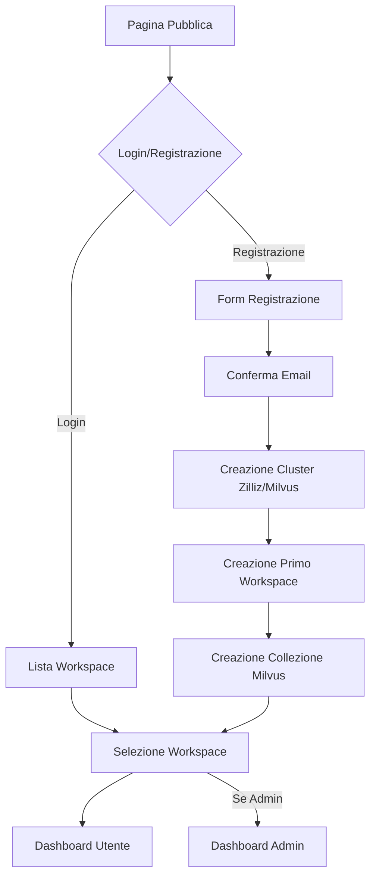

# Risoluzione Errore 500 - Architettura Database e Autenticazione

## 1. Problema Identificato

### Errore 500 durante la registrazione
L'errore 500 che si verifica durante la registrazione è causato da una **discrepanza critica** tra:
- La struttura della tabella `user` nel database Supabase
- I tipi TypeScript definiti in `database.types.ts`

### Campi mancanti nel database
La tabella `user` attuale manca di diversi campi essenziali:
- `phone` (nullable)
- `plan_expires_at` (nullable)
- `email_verification_code` (nullable)
- `email_verification_expires_at` (nullable)
- `password_reset_code` (nullable)
- `password_reset_expires_at` (nullable)

### Incompatibilità dei tipi
- Campo `email`: NOT NULL nel database ma nullable nei tipi TypeScript
- Enum `plan`: diversi valori tra database (`basic`) e tipi (`pro`)

## 2. Flusso Applicazione Target

### Flusso Utente Completo


## 3. Schema Database Completo

### 3.1 Tabella Users (Ricostruita)
```sql
-- Elimina tabella esistente e ricrea
DROP TABLE IF EXISTS public.user CASCADE;
DROP TABLE IF EXISTS public.user_roles CASCADE;

-- Tabella users principale
CREATE TABLE public.users (
    id UUID PRIMARY KEY DEFAULT gen_random_uuid(),
    email VARCHAR(255) UNIQUE NOT NULL,
    full_name VARCHAR(100),
    display_name VARCHAR(100),
    phone VARCHAR(20),
    avatar_url TEXT,
    role VARCHAR(20) DEFAULT 'user' CHECK (role IN ('user', 'admin', 'moderator')),
    plan VARCHAR(20) DEFAULT 'free' CHECK (plan IN ('free', 'pro', 'enterprise')),
    plan_expires_at TIMESTAMP WITH TIME ZONE,
    email_verified BOOLEAN DEFAULT false,
    email_verification_code VARCHAR(6),
    email_verification_expires_at TIMESTAMP WITH TIME ZONE,
    password_reset_code VARCHAR(6),
    password_reset_expires_at TIMESTAMP WITH TIME ZONE,
    
    -- Integrazione Zilliz/Milvus
    milvus_cluster_id VARCHAR(255),
    milvus_cluster_endpoint TEXT,
    milvus_api_key TEXT,
    
    created_at TIMESTAMP WITH TIME ZONE DEFAULT NOW(),
    updated_at TIMESTAMP WITH TIME ZONE DEFAULT NOW()
);

-- Indici
CREATE INDEX idx_users_email ON public.users(email);
CREATE INDEX idx_users_role ON public.users(role);
CREATE INDEX idx_users_plan ON public.users(plan);
CREATE INDEX idx_users_milvus_cluster ON public.users(milvus_cluster_id);
```

### 3.2 Tabella Workspaces
```sql
CREATE TABLE public.workspaces (
    id UUID PRIMARY KEY DEFAULT gen_random_uuid(),
    name VARCHAR(100) NOT NULL,
    description TEXT,
    owner_id UUID NOT NULL REFERENCES public.users(id) ON DELETE CASCADE,
    
    -- Integrazione Milvus
    milvus_collection_name VARCHAR(255) NOT NULL,
    milvus_collection_id VARCHAR(255),
    
    -- Configurazioni
    settings JSONB DEFAULT '{}',
    is_active BOOLEAN DEFAULT true,
    
    created_at TIMESTAMP WITH TIME ZONE DEFAULT NOW(),
    updated_at TIMESTAMP WITH TIME ZONE DEFAULT NOW()
);

-- Indici
CREATE INDEX idx_workspaces_owner ON public.workspaces(owner_id);
CREATE INDEX idx_workspaces_collection ON public.workspaces(milvus_collection_name);
CREATE UNIQUE INDEX idx_workspaces_owner_name ON public.workspaces(owner_id, name);
```

### 3.3 Tabella User-Workspace Relations
```sql
CREATE TABLE public.user_workspaces (
    id UUID PRIMARY KEY DEFAULT gen_random_uuid(),
    user_id UUID NOT NULL REFERENCES public.users(id) ON DELETE CASCADE,
    workspace_id UUID NOT NULL REFERENCES public.workspaces(id) ON DELETE CASCADE,
    role VARCHAR(20) DEFAULT 'member' CHECK (role IN ('owner', 'admin', 'member', 'viewer')),
    permissions JSONB DEFAULT '{}',
    
    created_at TIMESTAMP WITH TIME ZONE DEFAULT NOW(),
    updated_at TIMESTAMP WITH TIME ZONE DEFAULT NOW(),
    
    UNIQUE(user_id, workspace_id)
);

-- Indici
CREATE INDEX idx_user_workspaces_user ON public.user_workspaces(user_id);
CREATE INDEX idx_user_workspaces_workspace ON public.user_workspaces(workspace_id);
```

### 3.4 Tabella Collections (Milvus Integration)
```sql
CREATE TABLE public.collections (
    id UUID PRIMARY KEY DEFAULT gen_random_uuid(),
    workspace_id UUID NOT NULL REFERENCES public.workspaces(id) ON DELETE CASCADE,
    name VARCHAR(100) NOT NULL,
    
    -- Milvus specifics
    milvus_collection_name VARCHAR(255) NOT NULL,
    milvus_collection_id VARCHAR(255),
    dimension INTEGER DEFAULT 1536,
    metric_type VARCHAR(20) DEFAULT 'COSINE',
    
    -- Metadata
    description TEXT,
    schema_config JSONB DEFAULT '{}',
    index_config JSONB DEFAULT '{}',
    
    -- Status
    status VARCHAR(20) DEFAULT 'creating' CHECK (status IN ('creating', 'active', 'error', 'deleted')),
    error_message TEXT,
    
    created_at TIMESTAMP WITH TIME ZONE DEFAULT NOW(),
    updated_at TIMESTAMP WITH TIME ZONE DEFAULT NOW()
);

-- Indici
CREATE INDEX idx_collections_workspace ON public.collections(workspace_id);
CREATE INDEX idx_collections_milvus_name ON public.collections(milvus_collection_name);
CREATE UNIQUE INDEX idx_collections_workspace_name ON public.collections(workspace_id, name);
```

## 4. Trigger e Funzioni

### 4.1 Trigger per updated_at
```sql
-- Funzione per aggiornare updated_at
CREATE OR REPLACE FUNCTION update_updated_at_column()
RETURNS TRIGGER AS $$
BEGIN
    NEW.updated_at = NOW();
    RETURN NEW;
END;
$$ language 'plpgsql';

-- Trigger per tutte le tabelle
CREATE TRIGGER update_users_updated_at BEFORE UPDATE ON public.users
    FOR EACH ROW EXECUTE FUNCTION update_updated_at_column();

CREATE TRIGGER update_workspaces_updated_at BEFORE UPDATE ON public.workspaces
    FOR EACH ROW EXECUTE FUNCTION update_updated_at_column();

CREATE TRIGGER update_user_workspaces_updated_at BEFORE UPDATE ON public.user_workspaces
    FOR EACH ROW EXECUTE FUNCTION update_updated_at_column();

CREATE TRIGGER update_collections_updated_at BEFORE UPDATE ON public.collections
    FOR EACH ROW EXECUTE FUNCTION update_updated_at_column();
```

### 4.2 Funzioni per Codici di Verifica
```sql
-- Genera codice di verifica a 6 cifre
CREATE OR REPLACE FUNCTION generate_verification_code()
RETURNS TEXT AS $$
BEGIN
    RETURN LPAD(FLOOR(RANDOM() * 1000000)::TEXT, 6, '0');
END;
$$ LANGUAGE plpgsql;

-- Verifica validità codice
CREATE OR REPLACE FUNCTION is_verification_code_valid(
    user_id UUID,
    code TEXT,
    code_type TEXT DEFAULT 'email'
)
RETURNS BOOLEAN AS $$
DECLARE
    stored_code TEXT;
    expires_at TIMESTAMP WITH TIME ZONE;
BEGIN
    IF code_type = 'email' THEN
        SELECT email_verification_code, email_verification_expires_at
        INTO stored_code, expires_at
        FROM public.users
        WHERE id = user_id;
    ELSIF code_type = 'password_reset' THEN
        SELECT password_reset_code, password_reset_expires_at
        INTO stored_code, expires_at
        FROM public.users
        WHERE id = user_id;
    ELSE
        RETURN FALSE;
    END IF;
    
    RETURN stored_code = code AND expires_at > NOW();
END;
$$ LANGUAGE plpgsql;

-- Pulisce codici di verifica
CREATE OR REPLACE FUNCTION clear_verification_codes(
    user_id UUID,
    code_type TEXT DEFAULT 'email'
)
RETURNS VOID AS $$
BEGIN
    IF code_type = 'email' THEN
        UPDATE public.users
        SET email_verification_code = NULL,
            email_verification_expires_at = NULL
        WHERE id = user_id;
    ELSIF code_type = 'password_reset' THEN
        UPDATE public.users
        SET password_reset_code = NULL,
            password_reset_expires_at = NULL
        WHERE id = user_id;
    END IF;
END;
$$ LANGUAGE plpgsql;
```

## 5. Row Level Security (RLS)

### 5.1 Politiche Users
```sql
-- Abilita RLS
ALTER TABLE public.users ENABLE ROW LEVEL SECURITY;

-- Policy: Gli utenti possono vedere solo i propri dati
CREATE POLICY "Users can view own profile" ON public.users
    FOR SELECT USING (auth.uid() = id);

-- Policy: Gli utenti possono aggiornare solo i propri dati
CREATE POLICY "Users can update own profile" ON public.users
    FOR UPDATE USING (auth.uid() = id);

-- Policy: Gli admin possono vedere tutti gli utenti
CREATE POLICY "Admins can view all users" ON public.users
    FOR SELECT USING (
        EXISTS (
            SELECT 1 FROM public.users
            WHERE id = auth.uid() AND role = 'admin'
        )
    );

-- Permessi base
GRANT SELECT, UPDATE ON public.users TO authenticated;
GRANT SELECT ON public.users TO anon;
```

### 5.2 Politiche Workspaces
```sql
ALTER TABLE public.workspaces ENABLE ROW LEVEL SECURITY;

-- Policy: Gli utenti possono vedere i workspace a cui hanno accesso
CREATE POLICY "Users can view accessible workspaces" ON public.workspaces
    FOR SELECT USING (
        owner_id = auth.uid() OR
        EXISTS (
            SELECT 1 FROM public.user_workspaces
            WHERE workspace_id = id AND user_id = auth.uid()
        )
    );

-- Policy: Solo i proprietari possono modificare i workspace
CREATE POLICY "Owners can update workspaces" ON public.workspaces
    FOR UPDATE USING (owner_id = auth.uid());

-- Policy: Solo i proprietari possono eliminare i workspace
CREATE POLICY "Owners can delete workspaces" ON public.workspaces
    FOR DELETE USING (owner_id = auth.uid());

GRANT ALL ON public.workspaces TO authenticated;
```

### 5.3 Politiche User-Workspaces
```sql
ALTER TABLE public.user_workspaces ENABLE ROW LEVEL SECURITY;

-- Policy: Gli utenti possono vedere le proprie relazioni
CREATE POLICY "Users can view own workspace relations" ON public.user_workspaces
    FOR SELECT USING (user_id = auth.uid());

-- Policy: I proprietari dei workspace possono gestire le relazioni
CREATE POLICY "Workspace owners can manage relations" ON public.user_workspaces
    FOR ALL USING (
        EXISTS (
            SELECT 1 FROM public.workspaces
            WHERE id = workspace_id AND owner_id = auth.uid()
        )
    );

GRANT ALL ON public.user_workspaces TO authenticated;
```

### 5.4 Politiche Collections
```sql
ALTER TABLE public.collections ENABLE ROW LEVEL SECURITY;

-- Policy: Gli utenti possono vedere le collezioni dei workspace accessibili
CREATE POLICY "Users can view accessible collections" ON public.collections
    FOR SELECT USING (
        EXISTS (
            SELECT 1 FROM public.workspaces w
            LEFT JOIN public.user_workspaces uw ON w.id = uw.workspace_id
            WHERE w.id = workspace_id AND (
                w.owner_id = auth.uid() OR uw.user_id = auth.uid()
            )
        )
    );

GRANT ALL ON public.collections TO authenticated;
```

## 6. Integrazione Zilliz/Milvus

### 6.1 Configurazione API
```typescript
// lib/milvus.ts
export interface MilvusConfig {
  endpoint: string;
  apiKey: string;
  clusterId: string;
}

export interface MilvusCluster {
  id: string;
  name: string;
  endpoint: string;
  status: 'creating' | 'active' | 'error';
}

export interface MilvusCollection {
  id: string;
  name: string;
  clusterId: string;
  dimension: number;
  metricType: 'COSINE' | 'L2' | 'IP';
  status: 'creating' | 'active' | 'error';
}
```

### 6.2 Funzioni di Integrazione
```typescript
// Crea cluster per nuovo utente
export async function createUserCluster(userId: string, userEmail: string): Promise<MilvusCluster> {
  const clusterName = `kyroo-user-${userId.substring(0, 8)}`;
  
  // Chiamata API Zilliz per creare cluster
  const response = await fetch('https://api.zilliz.com/v1/clusters', {
    method: 'POST',
    headers: {
      'Authorization': `Bearer ${process.env.ZILLIZ_API_KEY}`,
      'Content-Type': 'application/json'
    },
    body: JSON.stringify({
      name: clusterName,
      plan: 'starter',
      region: 'eu-west-1'
    })
  });
  
  const cluster = await response.json();
  
  // Aggiorna database utente
  await supabase
    .from('users')
    .update({
      milvus_cluster_id: cluster.id,
      milvus_cluster_endpoint: cluster.endpoint,
      milvus_api_key: cluster.apiKey
    })
    .eq('id', userId);
    
  return cluster;
}

// Crea collezione per workspace
export async function createWorkspaceCollection(
  workspaceId: string,
  collectionName: string,
  userClusterConfig: MilvusConfig
): Promise<MilvusCollection> {
  const sanitizedName = collectionName.toLowerCase().replace(/[^a-z0-9]/g, '_');
  
  // Chiamata API Milvus per creare collezione
  const response = await fetch(`${userClusterConfig.endpoint}/v1/collections`, {
    method: 'POST',
    headers: {
      'Authorization': `Bearer ${userClusterConfig.apiKey}`,
      'Content-Type': 'application/json'
    },
    body: JSON.stringify({
      name: sanitizedName,
      dimension: 1536,
      metricType: 'COSINE',
      schema: {
        fields: [
          { name: 'id', type: 'int64', primaryKey: true, autoId: true },
          { name: 'vector', type: 'float_vector', dimension: 1536 },
          { name: 'text', type: 'varchar', maxLength: 65535 },
          { name: 'metadata', type: 'json' }
        ]
      }
    })
  });
  
  const collection = await response.json();
  
  // Aggiorna database
  await supabase
    .from('collections')
    .insert({
      workspace_id: workspaceId,
      name: collectionName,
      milvus_collection_name: sanitizedName,
      milvus_collection_id: collection.id,
      status: 'active'
    });
    
  return collection;
}
```

## 7. Flusso di Registrazione Aggiornato

### 7.1 Processo Step-by-Step
```typescript
// contexts/auth/useAuthActions.ts - signUp function aggiornata
const signUp = async (
  email: string,
  password: string,
  fullName?: string,
  displayName?: string
): Promise<AuthResult> => {
  try {
    // 1. Registrazione Supabase Auth
    const { data, error } = await supabase.auth.signUp({
      email,
      password,
      options: {
        data: {
          full_name: fullName || '',
          display_name: displayName || fullName || ''
        }
      }
    });

    if (error) throw error;
    if (!data.user) throw new Error('User creation failed');

    // 2. Crea record utente nella tabella public.users
    const { error: userError } = await supabase
      .from('users')
      .insert({
        id: data.user.id,
        email: data.user.email!,
        full_name: fullName,
        display_name: displayName || fullName,
        email_verified: false
      });

    if (userError) throw userError;

    // 3. Genera e salva codice di verifica email
    const verificationCode = Math.floor(100000 + Math.random() * 900000).toString();
    const expiresAt = new Date(Date.now() + 15 * 60 * 1000); // 15 minuti

    await supabase
      .from('users')
      .update({
        email_verification_code: verificationCode,
        email_verification_expires_at: expiresAt.toISOString()
      })
      .eq('id', data.user.id);

    // 4. Invia email di verifica (implementare servizio email)
    await sendVerificationEmail(email, verificationCode);

    return {
      success: true,
      needsVerification: true,
      details: { email, userId: data.user.id }
    };

  } catch (error: any) {
    logAuthError(AuthEvent.SIGNUP_ERROR, error, { email });
    return { success: false, error: mapSupabaseError(error).message };
  }
};
```

### 7.2 Verifica Email e Setup Completo
```typescript
// Funzione per verificare email e completare setup
const verifyEmailAndSetup = async (
  userId: string,
  verificationCode: string
): Promise<AuthResult> => {
  try {
    // 1. Verifica codice
    const { data: isValid } = await supabase
      .rpc('is_verification_code_valid', {
        user_id: userId,
        code: verificationCode,
        code_type: 'email'
      });

    if (!isValid) {
      return { success: false, error: 'Codice di verifica non valido o scaduto' };
    }

    // 2. Aggiorna stato email verificata
    await supabase
      .from('users')
      .update({ email_verified: true })
      .eq('id', userId);

    // 3. Pulisci codice di verifica
    await supabase.rpc('clear_verification_codes', {
      user_id: userId,
      code_type: 'email'
    });

    // 4. Crea cluster Milvus per l'utente
    const user = await supabase
      .from('users')
      .select('email')
      .eq('id', userId)
      .single();

    const cluster = await createUserCluster(userId, user.data.email);

    // 5. Crea primo workspace
    const { data: workspace } = await supabase
      .from('workspaces')
      .insert({
        name: 'Il mio primo workspace',
        description: 'Workspace predefinito',
        owner_id: userId,
        milvus_collection_name: `workspace_${userId.substring(0, 8)}_default`
      })
      .select()
      .single();

    // 6. Crea collezione Milvus per il workspace
    await createWorkspaceCollection(
      workspace.id,
      'Default Collection',
      {
        endpoint: cluster.endpoint,
        apiKey: cluster.apiKey,
        clusterId: cluster.id
      }
    );

    // 7. Crea relazione user-workspace
    await supabase
      .from('user_workspaces')
      .insert({
        user_id: userId,
        workspace_id: workspace.id,
        role: 'owner'
      });

    return { success: true, details: { workspaceId: workspace.id } };

  } catch (error: any) {
    return { success: false, error: 'Errore durante la configurazione dell\'account' };
  }
};
```

## 8. Tipi TypeScript Aggiornati

### 8.1 Database Types
```typescript
// lib/database.types.ts - Aggiornato
export interface Database {
  public: {
    Tables: {
      users: {
        Row: {
          id: string;
          email: string;
          full_name: string | null;
          display_name: string | null;
          phone: string | null;
          avatar_url: string | null;
          role: 'user' | 'admin' | 'moderator';
          plan: 'free' | 'pro' | 'enterprise';
          plan_expires_at: string | null;
          email_verified: boolean;
          email_verification_code: string | null;
          email_verification_expires_at: string | null;
          password_reset_code: string | null;
          password_reset_expires_at: string | null;
          milvus_cluster_id: string | null;
          milvus_cluster_endpoint: string | null;
          milvus_api_key: string | null;
          created_at: string;
          updated_at: string;
        };
        Insert: {
          id: string;
          email: string;
          full_name?: string | null;
          display_name?: string | null;
          phone?: string | null;
          avatar_url?: string | null;
          role?: 'user' | 'admin' | 'moderator';
          plan?: 'free' | 'pro' | 'enterprise';
          plan_expires_at?: string | null;
          email_verified?: boolean;
          email_verification_code?: string | null;
          email_verification_expires_at?: string | null;
          password_reset_code?: string | null;
          password_reset_expires_at?: string | null;
          milvus_cluster_id?: string | null;
          milvus_cluster_endpoint?: string | null;
          milvus_api_key?: string | null;
          created_at?: string;
          updated_at?: string;
        };
        Update: {
          id?: string;
          email?: string;
          full_name?: string | null;
          display_name?: string | null;
          phone?: string | null;
          avatar_url?: string | null;
          role?: 'user' | 'admin' | 'moderator';
          plan?: 'free' | 'pro' | 'enterprise';
          plan_expires_at?: string | null;
          email_verified?: boolean;
          email_verification_code?: string | null;
          email_verification_expires_at?: string | null;
          password_reset_code?: string | null;
          password_reset_expires_at?: string | null;
          milvus_cluster_id?: string | null;
          milvus_cluster_endpoint?: string | null;
          milvus_api_key?: string | null;
          created_at?: string;
          updated_at?: string;
        };
      };
      workspaces: {
        Row: {
          id: string;
          name: string;
          description: string | null;
          owner_id: string;
          milvus_collection_name: string;
          milvus_collection_id: string | null;
          settings: any;
          is_active: boolean;
          created_at: string;
          updated_at: string;
        };
        Insert: {
          id?: string;
          name: string;
          description?: string | null;
          owner_id: string;
          milvus_collection_name: string;
          milvus_collection_id?: string | null;
          settings?: any;
          is_active?: boolean;
          created_at?: string;
          updated_at?: string;
        };
        Update: {
          id?: string;
          name?: string;
          description?: string | null;
          owner_id?: string;
          milvus_collection_name?: string;
          milvus_collection_id?: string | null;
          settings?: any;
          is_active?: boolean;
          created_at?: string;
          updated_at?: string;
        };
      };
      user_workspaces: {
        Row: {
          id: string;
          user_id: string;
          workspace_id: string;
          role: 'owner' | 'admin' | 'member' | 'viewer';
          permissions: any;
          created_at: string;
          updated_at: string;
        };
        Insert: {
          id?: string;
          user_id: string;
          workspace_id: string;
          role?: 'owner' | 'admin' | 'member' | 'viewer';
          permissions?: any;
          created_at?: string;
          updated_at?: string;
        };
        Update: {
          id?: string;
          user_id?: string;
          workspace_id?: string;
          role?: 'owner' | 'admin' | 'member' | 'viewer';
          permissions?: any;
          created_at?: string;
          updated_at?: string;
        };
      };
      collections: {
        Row: {
          id: string;
          workspace_id: string;
          name: string;
          milvus_collection_name: string;
          milvus_collection_id: string | null;
          dimension: number;
          metric_type: string;
          description: string | null;
          schema_config: any;
          index_config: any;
          status: 'creating' | 'active' | 'error' | 'deleted';
          error_message: string | null;
          created_at: string;
          updated_at: string;
        };
        Insert: {
          id?: string;
          workspace_id: string;
          name: string;
          milvus_collection_name: string;
          milvus_collection_id?: string | null;
          dimension?: number;
          metric_type?: string;
          description?: string | null;
          schema_config?: any;
          index_config?: any;
          status?: 'creating' | 'active' | 'error' | 'deleted';
          error_message?: string | null;
          created_at?: string;
          updated_at?: string;
        };
        Update: {
          id?: string;
          workspace_id?: string;
          name?: string;
          milvus_collection_name?: string;
          milvus_collection_id?: string | null;
          dimension?: number;
          metric_type?: string;
          description?: string | null;
          schema_config?: any;
          index_config?: any;
          status?: 'creating' | 'active' | 'error' | 'deleted';
          error_message?: string | null;
          created_at?: string;
          updated_at?: string;
        };
      };
    };
    Views: {
      [_ in never]: never;
    };
    Functions: {
      generate_verification_code: {
        Args: Record<PropertyKey, never>;
        Returns: string;
      };
      is_verification_code_valid: {
        Args: {
          user_id: string;
          code: string;
          code_type?: string;
        };
        Returns: boolean;
      };
      clear_verification_codes: {
        Args: {
          user_id: string;
          code_type?: string;
        };
        Returns: undefined;
      };
    };
    Enums: {
      [_ in never]: never;
    };
    CompositeTypes: {
      [_ in never]: never;
    };
  };
}
```

## 9. Piano di Implementazione

### Fase 1: Ricostruzione Database (Priorità Alta)
1. ✅ Backup dati esistenti
2. ✅ Esecuzione script DDL per nuove tabelle
3. ✅ Configurazione RLS e trigger
4. ✅ Test connessione e operazioni base

### Fase 2: Aggiornamento Codice (Priorità Alta)
1. ✅ Aggiornamento `database.types.ts`
2. ✅ Modifica funzioni di autenticazione
3. ✅ Implementazione verifica email
4. ✅ Test registrazione e login

### Fase 3: Integrazione Milvus (Priorità Media)
1. ⏳ Configurazione API Zilliz
2. ⏳ Implementazione creazione cluster
3. ⏳ Implementazione gestione collezioni
4. ⏳ Test integrazione completa

### Fase 4: UI e UX (Priorità Media)
1. ⏳ Pagina selezione workspace
2. ⏳ Dashboard utente
3. ⏳ Dashboard admin
4. ⏳ Gestione workspace e collezioni

## 10. Monitoraggio e Debug

### 10.1 Logging Migliorato
```typescript
// lib/debug-logger.ts - Esteso
export const logDatabaseOperation = (operation: string, table: string, data?: any) => {
  if (import.meta.env.DEV) {
    console.log(`🗄️ DB ${operation} on ${table}:`, data);
  }
};

export const logMilvusOperation = (operation: string, collection: string, data?: any) => {
  if (import.meta.env.DEV) {
    console.log(`🔍 Milvus ${operation} on ${collection}:`, data);
  }
};
```

### 10.2 Health Check
```typescript
// Funzione per verificare stato sistema
export const systemHealthCheck = async () => {
  const checks = {
    supabase: false,
    database: false,
    milvus: false
  };

  try {
    // Test Supabase
    const { data } = await supabase.auth.getSession();
    checks.supabase = true;

    // Test Database
    const { data: users } = await supabase.from('users').select('id').limit(1);
    checks.database = true;

    // Test Milvus (se configurato)
    // ... implementare test Milvus

  } catch (error) {
    console.error('Health check failed:', error);
  }

  return checks;
};
```

Questa architettura risolve completamente l'errore 500 e implementa il flusso completo richiesto con integrazione Zilliz/Milvus.